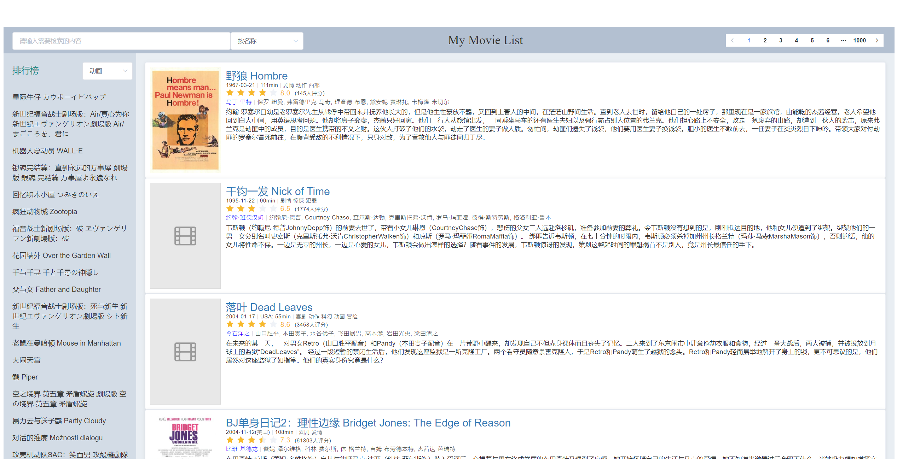
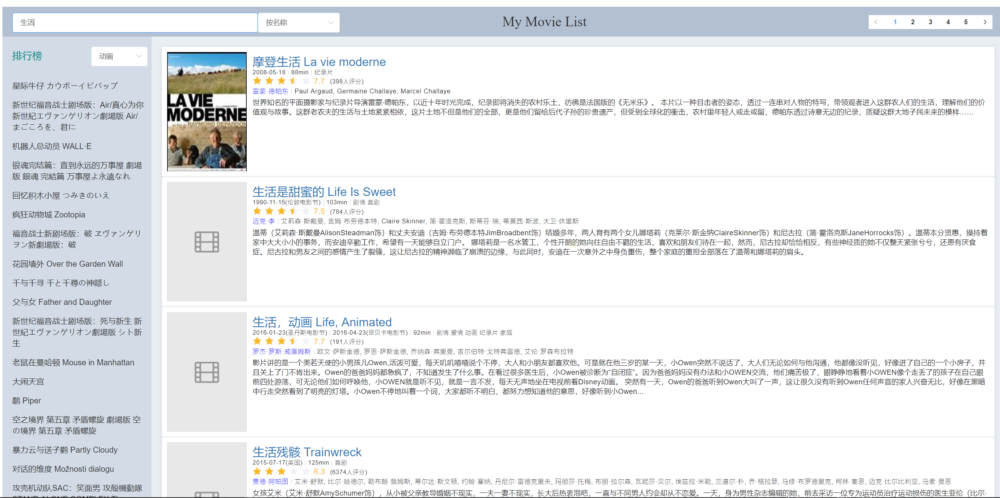
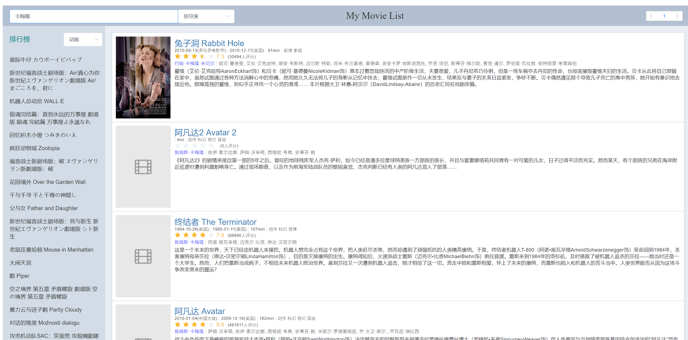
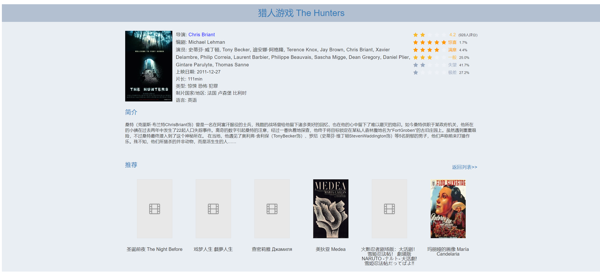

# My-Movie-List-Plus
电影列表和详情页展示

同济大学软件学院2019年网页开发课程第三次作业

## 部署方法

### 前端

在``./frontend``文件夹下执行：

```shell
npm install
npm run dev
```

如果需要打包，执行：

```shell
npm run build
```

### 后端

需要**Python3**运行环境，第三方模块包括：

- Flask
- Flask-RESTful
- Flask-PyMongo

在生产环境中，还需要：

- gevent

运行后端：

```shell
python run.py
```

### 数据库

具体安装方法请参考MongoDB[官网](https://docs.mongodb.com/manual/installation/)

#### 注意

在生产环境中，请将前端打包后的文件``avatar.png``放入``./static``文件夹下，再启动后端

## 1. 功能

### 基础功能

1. 前端请求后端，后端通过数据获取数据返回给前端
2. 电影列表展示
3. 分页（由前端分页调整至后端分页）

### 附加功能

1. 按多种类型搜索（``全文搜索``调整为``按简介``）
2. 电影详情页（调整为打开一个新页面展示电影详情）
3. 排行榜（按类型分榜/总榜）
4. 无法显示的海报图片自动替换
5. 可爱的favicon，见标签页左上角

## 2. 实现

### 前端

使用Vue CLi框架构建项目，基本沿用第二次作业的前端。新增axio组件发送ajax请求。同时将一系列前端分页、前端搜索调整至后端实现，前端仅发送相应的请求。

其中，涉及到搜索（即用户输入）的部分，一律使用POST请求，这是考虑到了输入中可能包含特殊字符，如果使用GET请求可能会导致出错。其余请求全部为GET请求。

### 后端

使用Flask框架构建项目。为了实现RESTful风格的API，同时引入Flask-RESTful模块。为了与数据库连接并访问，引入了Flask-PyMongo模块。

- 分页：使用``limit()``函数设置每页电影数量，并结合``skip()``函数设置偏移量。以当前页为n为例，获取第n页的电影数据（10条）的代码为：

  ```python
  pageSize = 10
  skip = pageSize * (page - 1)
  pageRecord = mongo.db.films.find()
  pageRecord = pageRecord.limit(pageSize).skip(skip)
  ```

- 排行榜：由于我使用rating字段中average的值进行排序，如果直接存入MySQL，显然是难以通过数据库直接排序的。但是对于MongoDB而言，事情就十分简单了：

  ```python
  movies = mongo.db.films.find({'genres': genre}, {'title': 1}).sort([("rating.average", -1)])
  ```

  其中，``-1``代表降序排列。

- 搜索：由于是模糊搜索，所以后端使用了正则表达式，引入了re模块：

  ```python
  rexExp = re.compile('.*' + title + '.*', re.IGNORECASE)
  movies = mongo.db.films.find({'title': rexExp})
  ```

  搜索本身并不困难，只要指定搜索的字段即可。电影名称对应``title``字段，导演对应``directors``字段，演员对应``casts``字段，简介对应``summary``字段。即使字段中的值是一个数组也不需要特殊处理，``find()``函数可以正常返回结果。

  其中，``re.IGNORECASE``时忽略大小写。

- 电影类型列表：电影类型列表是由后端动态生成，而非前端硬编码的。使用``distinct()``即可将所有电影类型去重。

  ```python
  genres = mongo.db.films.find().distinct('genres')
  ```

  之后删去类型列表中为空的一个，即可得到所有类型组成的列表，共37种类型。

- 在生产环境中，为了保证可以应对多个并发请求，需要使用WSGI server。于是我使用了gevent模块，并将后端``main``代码做了一点修改：

  ```python
  http_server = WSGIServer(('', 5000), app)
  http_server.serve_forever()
  ```

  这样，就可以保证对于较高并发量的应对了。

### 数据库

使用MongoDB作为数据库，这是因为考虑到作业提供的JSON文件包含很复杂的嵌套结构，所以最适合于导入MongoDB。具体的导入指令为：

```shell
mongoimport --db movies --collection films --file /xxx/xxx/films_all.json --jsonArray
```

## 3. 项目演示及说明

项目的演示效果与[第二次作业](https://github.com/pancerZH/My-Movie-List)的演示效果基本一致。

线上项目地址：http://101.132.158.233:5000

线上项目有效期至2019年6月11日0点。

#### 电影列表



#### 搜索





#### 电影详情



